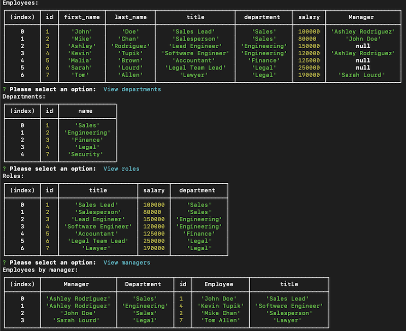
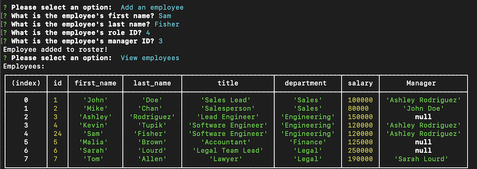

# Employee Management System
## Introduction
Companies are always on the lookout for a CMS (Content Management System) interface. This is a demonstration of how one can be created and used to assist with keeping track of a company's employees.
 

## Technologies Used
* JavaScript
* NodeJS
* MySQL
* Inquirer
  
   

## Usage
The Employee Tracker application can be used to view employees, departments, roles within departments, and even the managers of employees. This application also allows the addition and removal of employees, departments, and roles as well as the reassignment of an employee's role.  A video demonstration of the application can be viewed [here](https://youtu.be/LG3UekMNL9U).

   

## Screenshots

 
    Employee, department, role, and manager data

 

 
    Adding an employee to the roster

 

## Contact Information
If you have questions about the application or contributions, I can be contacted via email at:
<maynperalta@gmail.com>
 